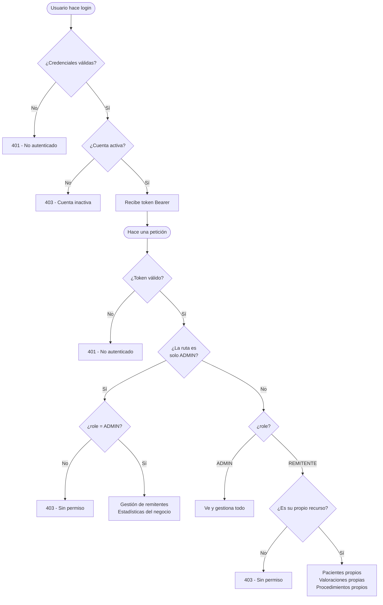

# XIMCA · Backend

### API REST · Laravel 11 · Sanctum · MySQL


---

## Descripción general

XIMCA Backend es la API REST que alimenta la plataforma de gestión clínica para medicina estética en Colombia. Expone todos los endpoints consumidos por el frontend (Next.js 15), gestiona la autenticación por sesión (Laravel Sanctum SPA), el control de roles y la lógica de negocio clínica: pacientes, valoraciones médicas, procedimientos, estadísticas e imágenes antes/después.

|                      |                                                   |
| -------------------- | ------------------------------------------------- |
| **Versión API**      | `v1` — `/api/v1/...`                              |
| **Base URL (local)** | `http://localhost:8000/api/v1`                    |
| **Autenticación**    | Laravel Sanctum — cookies + sesión (SPA stateful) |
| **Base de datos**    | MySQL (compatible MariaDB · SQLite para pruebas)  |

---

## Stack tecnológico

**Backend**

- **Laravel** (11.x) — Framework PHP principal
- **PHP** (^8.2) — Lenguaje base
- **Laravel Sanctum** (~4.0) — Autenticación SPA por cookies + sesión
- **MySQL / MariaDB** — Base de datos principal (SQLite en pruebas)
- **Carbon** (incluido) — Manejo de fechas (edad del paciente, auditorías)
- **Google Calendar API** (OAuth 2.0) — Integración de citas _(módulo en pausa)_

**Herramientas de desarrollo**

- **Artisan** — generador de migraciones, seeders y controladores
- **Factories + Seeders** — datos de prueba (`ClinicSeeder`)
- **PHPUnit** — pruebas unitarias y de feature
- **PHP-CS-Fixer / Pint** — estilo de código

---

## Estructura del proyecto

### Controladores `/app/Http/Controllers/`

| Archivo                                 | Responsabilidad                                             |
| --------------------------------------- | ----------------------------------------------------------- |
| `Auth/AuthController.php`               | login, logout, me (usuario autenticado)                     |
| `Auth/GoogleCalendarAuthController.php` | OAuth 2.0 con Google _(en pausa)_                           |
| `API/PatientController.php`             | CRUD de pacientes con búsqueda                              |
| `API/MedicalEvaluationController.php`   | Valoraciones con estados EN_ESPERA / CONFIRMADO / CANCELADO |
| `API/ProcedureController.php`           | Procedimientos vinculados a valoraciones                    |
| `API/ClinicalImageController.php`       | Galería antes/después con almacenamiento local              |
| `API/StatsController.php`               | KPIs, top procedimientos, ingresos por remitente            |
| `API/UserController.php`                | Gestión de remitentes (crear, activar, inactivar, despedir) |
| `API/AppointmentController.php`         | Citas con integración Google Calendar _(en pausa)_          |
| `API/InventoryController.php`           | Categorías, productos, compras, consumos y reportes de inventario |
| `API/DistributorController.php`         | CRUD de distribuidores/proveedores                          |

### Modelos `/app/Models/`

| Modelo                  | Descripción                                                              |
| ----------------------- | ------------------------------------------------------------------------ |
| `User`                  | Roles ADMIN / REMITENTE · estados active / inactive / fired              |
| `Patient`               | Datos demográficos · cédula única · fecha de nacimiento → edad calculada |
| `MedicalEvaluation`     | Peso/talla/IMC auto-calculado · estados de flujo clínico                 |
| `Procedure`             | Vinculado a valoración · monto total calculado desde items               |
| `ProcedureItem`         | Ítem individual con precio en COP                                        |
| `ClinicalImage`         | Imágenes before/after almacenadas en `storage/public`                    |
| `Appointment`           | Cita con estado y evento de Google Calendar _(en pausa)_                 |
| `GoogleCalendarSetting` | Tokens OAuth por usuario _(en pausa)_                                    |
| `InventoryCategory`     | Categorías de productos · pertenece a un usuario ADMIN                   |
| `InventoryProduct`      | Productos tipados (`insumo` / `equipo`) · stock con alertas calculadas   |
| `InventoryPurchase`     | Compra de producto · precio unitario + total · distribuidor opcional     |
| `InventoryUsage`        | Consumo de producto · vinculable a valoración clínica o uso general      |
| `Distributor`           | Proveedor con nombre, celular y email                                    |

### Servicios `/app/Services/`

- `GoogleCalendarService.php` — CRUD de eventos · OAuth · refresh automático de tokens

### Middleware `/app/Http/Middleware/`

- `AdminMiddleware` — restringe rutas exclusivas a rol ADMIN

---

## Modelos de datos

### Relaciones principales

El esquema sigue un flujo lineal de atención clínica:

```
USERS → crea → PATIENTS → tiene → MEDICAL_EVALUATIONS → contiene → PROCEDURES → incluye → PROCEDURE_ITEMS
```

### `MedicalEvaluation` — campos clave

| Campo                       | Tipo             | Descripción                                         |
| --------------------------- | ---------------- | --------------------------------------------------- |
| `id`                        | bigint PK        | Identificador único                                 |
| `patient_id`                | FK → patients    | Paciente evaluado                                   |
| `user_id`                   | FK → users       | Remitente que registra                              |
| `weight / height`           | float            | Peso (kg) y talla (m)                               |
| `bmi / bmi_status`          | decimal / string | IMC auto-calculado y clasificación OMS              |
| `medical_background`        | text             | Antecedentes médicos                                |
| `status`                    | ENUM             | `EN_ESPERA` · `CONFIRMADO` · `CANCELADO`            |
| `confirmed_at`              | datetime         | Timestamp de confirmación (auditoría)               |
| `confirmed_by_user_id`      | FK → users       | Usuario que confirmó (auditoría)                    |
| `referrer_name`             | string(50)       | Nombre del remitente en el momento de la evaluación |
| `patient_age_at_evaluation` | integer          | Edad capturada al momento del registro              |

### `User` — roles y estados

| Campo                     | Tipo              | Descripción                                     |
| ------------------------- | ----------------- | ----------------------------------------------- |
| `role`                    | ENUM              | `ADMIN` · `REMITENTE`                           |
| `status`                  | ENUM              | `active` · `inactive` · `fired`                 |
| `brand_name / brand_slug` | string(50)        | Marca clínica asociada (multi-tenant preparado) |
| `cedula`                  | string(15) UNIQUE | Solo en pacientes — previene duplicados         |

---

## Rutas de la API (`/api/v1/`)

### Públicas

| Método | Ruta               | Descripción                       | Auth    |
| ------ | ------------------ | --------------------------------- | ------- |
| `GET`  | `/test`            | Health check del API              | Público |
| `GET`  | `/clinical-images` | Galería antes/después (landing)   | Público |
| `POST` | `/login`           | Inicio de sesión (cookie Sanctum) | Público |

### Autenticadas (`auth:sanctum`)

| Método   | Ruta                                  | Descripción                                    |
| -------- | ------------------------------------- | ---------------------------------------------- |
| `GET`    | `/me`                                 | Usuario autenticado actual                     |
| `POST`   | `/logout`                             | Cierre de sesión                               |
| `GET`    | `/patients`                           | Listar pacientes (búsqueda por nombre/cédula)  |
| `GET`    | `/patients/{id}`                      | Detalle de paciente + historial clínico        |
| `POST`   | `/patients`                           | Registrar paciente (verifica cédula duplicada) |
| `GET`    | `/medical-evaluation/patient/{id}`    | Valoraciones por paciente                      |
| `GET`    | `/medical-evaluations/{id}`           | Detalle de una valoración                      |
| `POST`   | `/medical-evaluations`                | Crear valoración (calcula IMC automáticamente) |
| `PUT`    | `/medical-evaluations/{id}`           | Actualizar valoración (solo EN_ESPERA)         |
| `PATCH`  | `/medical-evaluations/{id}/confirmar` | Confirmar valoración (bloquea edición)         |
| `PATCH`  | `/medical-evaluations/{id}/cancelar`  | Cancelar valoración                            |
| `GET`    | `/procedures`                         | Listar procedimientos (filtro por evaluación)  |
| `POST`   | `/procedures`                         | Crear procedimiento con items (calcula total)  |
| `PUT`    | `/procedures/{id}`                    | Actualizar procedimiento (reemplaza items)     |
| `POST`   | `/clinical-images`                    | Subir par de imágenes antes/después            |
| `PUT`    | `/clinical-images/{id}`               | Actualizar imágenes (reemplaza archivos)       |
| `DELETE` | `/clinical-images/{id}`               | Eliminar imágenes (limpia storage)             |

### Solo ADMIN (`auth:sanctum` + `admin`)

| Método  | Ruta                                   | Descripción                              |
| ------- | -------------------------------------- | ---------------------------------------- |
| `GET`   | `/remitentes`                          | Listar todos los remitentes              |
| `POST`  | `/remitentes`                          | Crear nuevo remitente                    |
| `PUT`   | `/admin/{id}`                          | Actualizar datos del admin (solo propio) |
| `PUT`   | `/remitentes/{id}`                     | Actualizar datos de remitente            |
| `PATCH` | `/remitentes/{id}/activar`             | Activar remitente                        |
| `PATCH` | `/remitentes/{id}/inactivar`           | Pausar remitente temporalmente           |
| `PATCH` | `/remitentes/{id}/despedir`            | Marcar remitente como despedido          |
| `GET`   | `/stats/summary`                       | KPIs del mes actual vs mes anterior      |
| `GET`   | `/stats/referrer-stats`                | Pacientes e ingresos por remitente       |
| `GET`   | `/stats/income-monthly`                | Ingresos mensuales históricos            |
| `GET`   | `/stats/income-weekly`                 | Ingresos de la semana actual por día     |
| `GET`   | `/stats/procedures/top-demand`         | Top 5 procedimientos por cantidad        |
| `GET`   | `/stats/procedures/top-income`         | Top 5 procedimientos por ingresos        |
| `GET`   | `/stats/income-by-procedure`           | Ingresos históricos por tipo             |
| `GET`   | `/stats/conversion-rate`               | Tasa de conversión                       |
| `GET`   | `/stats/patients-monthly`              | Nuevos pacientes por mes                 |
### Inventario (`/api/v1/inventory/`) — Autenticadas (ambos roles)

| Método | Ruta                                          | Descripción                                               |
| ------ | --------------------------------------------- | --------------------------------------------------------- |
| `GET`  | `/inventory/categories`                       | Listar todas las categorías de inventario                 |
| `GET`  | `/inventory/products`                         | Catálogo completo de productos (insumos y equipos)        |
| `GET`  | `/inventory/products/notifications`           | Resumen de alertas de stock bajo (solo insumos)           |
| `GET`  | `/inventory/distributors`                     | Listar distribuidores/proveedores                         |
| `GET`  | `/inventory/purchases`                        | Listar compras (filtros: `search`, `category_id`)         |
| `POST` | `/inventory/purchases`                        | Registrar compra (sube stock del producto)                |
| `GET`  | `/inventory/purchases/last/{productId}`       | Última compra de un producto (precio y distribuidor)      |
| `GET`  | `/inventory/usages`                           | Listar consumos (filtros: `search`, `category_id`)        |
| `POST` | `/inventory/usages`                           | Registrar consumo (descuenta stock si es insumo)          |
| `GET`  | `/inventory/reports/spend-by-category`        | Gasto agrupado por categoría (filtros: `month`, `year`)   |
| `GET`  | `/inventory/reports/spend-by-distributor`     | Gasto agrupado por distribuidor (filtros: `month`, `year`)|
| `GET`  | `/inventory/reports/price-history/{productId}`| Historial de precios de compra de un producto             |

### Inventario — Solo ADMIN

| Método | Ruta                             | Descripción                                          |
| ------ | -------------------------------- | ---------------------------------------------------- |
| `POST` | `/inventory/distributors`        | Crear distribuidor                                   |
| `PUT`  | `/inventory/distributors/{id}`   | Actualizar distribuidor                              |
| `POST` | `/inventory/categories`          | Crear categoría de inventario                        |
| `PUT`  | `/inventory/categories/{id}`     | Renombrar categoría de inventario                    |
| `GET`  | `/inventory/summary`             | Resumen financiero: ingresos, gastos y utilidad neta |
---

## Seguridad y autenticación

### Laravel Sanctum (SPA Stateful)

- El frontend envía **cookies firmadas** en lugar de tokens Bearer. Esto protege contra ataques XSS porque la cookie `httpOnly` no es accesible desde JavaScript.
- Al iniciar sesión, Sanctum **regenera el ID de sesión** para prevenir session fixation.
- El middleware `EnsureFrontendRequestsAreStateful` se aplica a todas las rutas del grupo `api`, asegurando que solo el dominio configurado (`localhost:3000` en desarrollo) pueda hacer peticiones stateful.
- **CSRF:** el frontend obtiene el token en `/sanctum/csrf-cookie` antes de cada mutación.

### Control de acceso por roles

- **ADMIN** — acceso completo: gestiona remitentes, ve estadísticas globales, administra imágenes clínicas y accede a todos los recursos del sistema.
- **REMITENTE** — acceso restringido a sus propios recursos: solo ve y opera sobre los pacientes, valoraciones y procedimientos que él mismo registró. Si su cuenta está `inactive` o `fired`, el servidor devuelve `403` antes de ejecutar cualquier operación.
- `AdminMiddleware` — middleware personalizado que valida `isAdmin()` antes de llegar al controlador.



### Validación con Form Requests

Cada endpoint usa una clase dedicada (`StorePatientRequest`, `StoreMedicalEvaluationRequest`, etc.) que encapsula reglas de validación y mensajes de error en español.

---

## Lógica de negocio clínica

### Cálculo automático de IMC

Al crear o actualizar una `MedicalEvaluation`, el backend calcula el IMC y lo clasifica según la escala OMS (8 categorías, de _Delgadez severa_ < 16.0 hasta _Obesidad grado III_ ≥ 40).

```php
$bmi = round($weight / ($height * $height), 2);
```

### Flujo de estados de valoración

```
EN_ESPERA ──→ CONFIRMADO
     └──────→ CANCELADO
```

- Cada transición registra **timestamp** y el **usuario** que la ejecutó (auditoría completa).
- Una valoración `CONFIRMADA` no puede editarse. Debe cancelarse primero.
- Los campos `confirmed_by_user_id` y `canceled_by_user_id` usan `nullOnDelete` para no perder historial si el usuario se elimina.

### Prevención de pacientes duplicados

Al registrar un paciente, se verifica si ya existe un registro con la misma cédula. Si existe, se devuelve el registro existente con `HTTP 200` en lugar de crear uno nuevo.

### Estadísticas (`StatsController`)

| Método            | Descripción                                                  |
| ----------------- | ------------------------------------------------------------ |
| `summary()`       | KPIs del mes actual vs mes anterior con variación porcentual |
| `referrerStats()` | Pacientes e ingresos por remitente, en el mes y acumulado    |
| `topByDemand()`   | Top 5 procedimientos más realizados del mes                  |
| `topByIncome()`   | Top 5 procedimientos más rentables del mes                   |
| `incomeMonthly()` | Series temporales de ingresos mensuales                      |
| `incomeWeekly()`  | Ingresos de la semana actual por día                         |

---

## Base de datos

### Tablas principales

| Tabla                      | Descripción                                                                         |
| -------------------------- | ----------------------------------------------------------------------------------- |
| `users`                    | Roles + estados + campos de marca (`brand_name`, `brand_slug`)                      |
| `patients`                 | Datos demográficos, cédula única, `fecha_nacimiento` (edad calculada dinámicamente) |
| `medical_evaluations`      | Evaluación clínica con IMC, antecedentes y flujo de estados                         |
| `procedures`               | Procedimiento vinculado a una valoración + monto total                              |
| `procedure_items`          | Ítems individuales con nombre y precio                                              |
| `clinical_images`          | Rutas de imágenes antes/después en `storage/public`                                 |
| `appointments`             | Citas _(en pausa, estructura lista para Google Calendar)_                           |
| `google_calendar_settings` | Tokens OAuth por usuario _(en pausa)_                                               |
| `inventory_categories`     | Categorías de productos · creadas por un usuario ADMIN                              |
| `inventory_products`       | Productos tipados con stock actual, stock mínimo y estado calculado                 |
| `inventory_purchases`      | Compras vinculadas a producto, usuario y distribuidor · precio unitario y total     |
| `inventory_usages`         | Consumos con estado `con_paciente` / `sin_paciente` · razón y fecha de uso          |
| `distributors`             | Proveedores con nombre, celular y email                                             |

### Migraciones notables

- Campos clínicos (peso, talla, IMC) se movieron de `patients` a `medical_evaluations` para separar correctamente la información demográfica de la clínica.
- `referrer_name` se trasladó de `patients` a `medical_evaluations`, ya que el remitente puede cambiar entre valoraciones del mismo paciente.
- `age` (campo estático) fue reemplazado por `date_of_birth` + atributo calculado `$patient->age` usando Carbon.
- `patient_age_at_evaluation` captura la edad en el momento exacto del registro, preservando el dato histórico.

### `inventory_products` — campos clave

| Campo          | Tipo                       | Descripción                                                                  |
| -------------- | -------------------------- | ---------------------------------------------------------------------------- |
| `id`           | bigint PK                  | Identificador único                                                          |
| `category_id`  | FK → inventory_categories  | Categoría del producto                                                       |
| `name`         | string(100)                | Nombre del producto                                                          |
| `description`  | string(255) nullable       | Descripción opcional                                                         |
| `type`         | ENUM                       | `insumo` (consumible con stock) · `equipo` (sin stock mínimo)                |
| `stock_actual` | integer                    | Unidades disponibles actualmente                                             |
| `stock_minimo` | integer default 0          | Umbral de alerta de stock bajo (solo insumos)                                |
| `estado`       | _appended_                 | `Disponible` · `Crítico` · `Agotado` · `null` para equipos                  |
| `label_stock`  | _appended_                 | `Stock` para insumos · `Cantidad` para equipos                               |
| `cantidad`     | _appended_                 | Alias de `stock_actual` para consistencia en el frontend                     |

### `inventory_purchases` — campos clave

| Campo           | Tipo                      | Descripción                                             |
| --------------- | ------------------------- | ------------------------------------------------------- |
| `id`            | bigint PK                 | Identificador único                                     |
| `user_id`       | FK → users                | Usuario que registró la compra                          |
| `product_id`    | FK → inventory_products   | Producto adquirido                                      |
| `distributor_id`| FK → distributors nullable| Proveedor asociado (null si no se especifica)           |
| `quantity`      | unsignedInteger           | Cantidad comprada (se suma al stock)                    |
| `unit_price`    | decimal(10,2)             | Precio unitario en COP                                  |
| `total_price`   | decimal(10,2)             | Total calculado (`quantity × unit_price`)               |
| `purchase_date` | date                      | Fecha de la compra                                      |
| `notes`         | text nullable             | Observaciones opcionales                                |

### `inventory_usages` — campos clave

| Campo                  | Tipo                          | Descripción                                                  |
| ---------------------- | ----------------------------- | ------------------------------------------------------------ |
| `id`                   | bigint PK                     | Identificador único                                          |
| `product_id`           | FK → inventory_products       | Producto consumido                                           |
| `user_id`              | FK → users                    | Usuario que registró el consumo                              |
| `medical_evaluation_id`| FK → medical_evaluations null | Valoración asociada (solo si `status = con_paciente`)        |
| `quantity`             | integer                       | Unidades consumidas (se restan del stock si es insumo)       |
| `status`               | ENUM                          | `con_paciente` · `sin_paciente`                              |
| `reason`               | string(500) nullable          | Motivo del consumo                                           |
| `usage_date`           | date                          | Fecha del consumo                                            |

### Seeder (`ClinicSeeder`)

Genera datos de prueba realistas: 1 admin, 5 remitentes activos, 2 inactivos, 2 despedidos, 15 pacientes con 1–2 valoraciones cada uno y 1–4 procedimientos por valoración.

```bash
php artisan db:seed
```

---

## Configuración e instalación

### Variables de entorno (`.env`)

| Variable                    | Descripción                              |
| --------------------------- | ---------------------------------------- |
| `APP_NAME`                  | Nombre de la aplicación                  |
| `BRAND_NAME`                | Nombre de la clínica (Coldesthetic)      |
| `BRAND_SLUG`                | Slug de la clínica (coldesthetic)        |
| `DB_CONNECTION`             | Driver de base de datos (`mysql`)        |
| `DB_HOST / DB_PORT`         | `127.0.0.1` / `3306`                     |
| `DB_DATABASE`               | Nombre de la base de datos               |
| `DB_USERNAME / DB_PASSWORD` | Credenciales MySQL                       |
| `SANCTUM_STATEFUL_DOMAINS`  | `localhost:3000` en desarrollo           |
| `SESSION_DRIVER`            | `database` — Sesiones en BD (producción) |
| `GOOGLE_CLIENT_ID / SECRET` | OAuth Google Calendar _(en pausa)_       |

### Instalación local

```bash
# 1. Clonar repositorio e instalar dependencias
composer install

# 2. Copiar y configurar variables de entorno
cp .env.example .env

# 3. Generar clave de aplicación
php artisan key:generate

# 4. Crear base de datos MySQL
# Ver scripts/mysql_setup.sql

# 5. Ejecutar migraciones
php artisan migrate

# 6. Poblar con datos de prueba
php artisan db:seed

# 7. Crear enlace simbólico para imágenes
php artisan storage:link

# 8. Iniciar servidor de desarrollo
php artisan serve --host=127.0.0.1 --port=8000
```

---

## Módulo de Inventario

### Tipos de producto

El inventario diferencia dos tipos de producto con comportamientos distintos:

| Tipo      | `stock_actual` | `stock_minimo` | Alertas | Descuenta al consumir |
| --------- | -------------- | -------------- | ------- | --------------------- |
| `insumo`  | Sí             | Sí             | Sí      | Sí                    |
| `equipo`  | Sí (cantidad)  | No aplica      | No      | No                    |

### Estado de stock calculado (`estado`)

Solo para insumos. Se expone como atributo appended en el modelo:

```
stock_actual <= 0             → Agotado
stock_actual <= stock_minimo  → Crítico
de lo contrario               → Disponible
```

Los equipos devuelven `null` en `estado`.

### Flujo de compras

Al registrar una compra (`POST /inventory/purchases`), el servicio:
1. Valida que el producto exista.
2. Suma `quantity` a `stock_actual` del producto.
3. Persiste el registro con precio unitario, total y distribuidor.

### Flujo de consumos

Al registrar un consumo (`POST /inventory/usages`) se admiten dos modos según `status`:

```
con_paciente  → requiere medical_evaluation_id · registra consumo clínico
sin_paciente  → requiere reason · registra consumo general (merma, limpieza, etc.)
```

Para **insumos**, el sistema valida que `stock_actual >= quantity` antes de descontar. Si no hay stock suficiente, devuelve `422 Unprocessable Entity`.  
Para **equipos**, se registra el uso sin modificar `stock_actual`.

### Resumen financiero (`GET /inventory/summary`)

Disponible solo para ADMIN. Devuelve:

```json
{
  "total_income":   0.00,
  "total_expenses": 0.00,
  "net_profit":     0.00
}
```

`total_expenses` = suma de todos los `total_price` en `inventory_purchases`.  
`net_profit` = `total_income` − `total_expenses`.

---

## Módulos en desarrollo

### Citas médicas + Google Calendar

`AppointmentController`, `GoogleCalendarAuthController` y `GoogleCalendarService` están implementados y testeados, pero temporalmente comentados en `routes/api.php`. El módulo incluye:

- CRUD completo de citas con estados: `pending → confirmed → completed / cancelled`
- Sincronización automática con Google Calendar del usuario autenticado (OAuth 2.0)
- Recordatorios automáticos: popup 1 día antes y 1 hora antes
- Conversión de cita a procedimiento completado (`completeAppointment`)
- Refresh automático de `access_token` cuando expira

> Para reactivarlo: descomentar las líneas marcadas con `TODO` en `routes/api.php`.

---

## Diagrama de flujo del sistema

El siguiente diagrama fue elaborado en **draw.io** durante la fase de planeación del sistema. Representa el flujo clínico completo, las reglas de negocio, los estados de valoración, los roles de usuario, y los módulos de estadísticas y seguridad.

> 📂 Archivo: `XIMCAFLUJO_drawio.html` — abrir en el navegador para ver el diagrama interactivo completo.

### Flujo clínico del paciente

```
Remitente ──→ Paciente ──→ Valoración ──→ Procedimiento ──→ Estado final
```

Un mismo paciente puede tener múltiples valoraciones (incluyendo antecedentes como diabetes o medicación de depresión). El remitente registra al paciente y crea la valoración clínica.

### Estados de valoración

```
              ┌──────────────────────────────────────────────────────────┐
              │  El registro clínico tiene 3 estados                     │
              └──────────────────────────────────────────────────────────┘

  EN_ESPERA ──→ se confirma el procedimiento ──→  ✅ CONFIRMADO
      │
      └────── no se realiza el procedimiento ──→  ❌ CANCELADO
```

| Estado       | Color       | Se cuenta en finanzas |
| ------------ | ----------- | --------------------- |
| `EN_ESPERA`  | 🟡 Amarillo | No                    |
| `CONFIRMADO` | 🟢 Verde    | **Sí**                |
| `CANCELADO`  | 🔴 Rojo     | No                    |

### Reglas de negocio definidas en el diagrama

> **1. No se puede modificar ni editar un registro confirmado.**
> El sistema es de auditoría: los registros confirman hechos clínicos históricos.

> **2. Si se equivoca un registro, se crea uno nuevo.**
> No se editan registros existentes; se cancela el erróneo y se registra correctamente.

> **3. Solo los registros `CONFIRMADOS` cuentan en finanzas.**
> Los estados `EN_ESPERA` y `CANCELADO` se excluyen de ingresos y estadísticas financieras.

### Roles planeados en el diagrama

```
ROLES
  ├── ADMIN  (Médico Líder)
  │     └── Permisos: crear registros clínicos · crear/modificar/eliminar fotos
  │                   ver estadísticas globales · exportar reportes
  │                   crear/desactivar remitentes · ver pacientes
  │
  └── REMITENTE  (Médico Colaborador)
        └── Permisos: crear registros clínicos · crear/modificar/eliminar fotos
                      ver ingresos propios · ver pacientes y registros clínicos
```

> **Decisión de diseño:** El ADMIN puede _desactivar_ (no eliminar) a un REMITENTE, preservando el historial de registros clínicos asociados.

### Flujo de autenticación (seguridad)

```
Médico/Admin ──→ Correo + Contraseña ──→ Verificación SMS ──→ Acceso al sistema
```

> La verificación SMS (2FA) fue planeada en el diagrama. La implementación actual usa Laravel Sanctum con correo + contraseña; el 2FA queda como mejora futura.

### Estadísticas (comparaciones planificadas)

El diagrama definió comparaciones en tres granularidades:

```
Estadísticas ──→ Comparación ──→ Mensual
                             ├── Semestral
                             └── Anual
```

El módulo actual implementa comparaciones **mensuales** (mes actual vs. mes anterior) y series históricas.

---

## Equipo

XIMCA es un proyecto construido en colaboración para clientes reales del sector de medicina estética en Colombia.

|                                                        | Liderazgo                                                                | Participación            |
| ------------------------------------------------------ | ------------------------------------------------------------------------ | ------------------------ |
| **[@karol-cc](https://github.com/karol-cc)**           | Backend — API REST, base de datos, lógica de negocio, seguridad          | Colaboración en frontend |
| **[@ximenabaquero](https://github.com/ximenabaquero)** | Frontend — arquitectura, componentes, UI/UX, autenticación, estadísticas | Colaboración en backend  |

---

_XIMCA · Bogotá, Colombia · 2025–2026_
